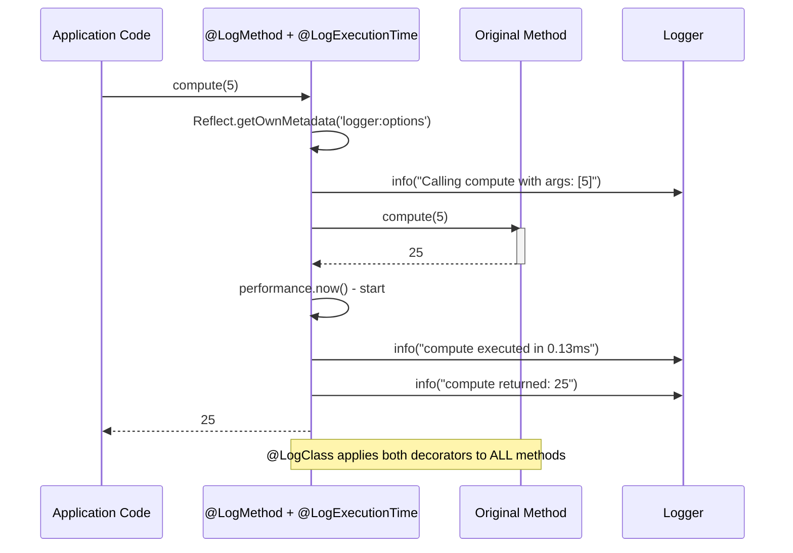

# NEETCODE — ts106: Logger Decorator Library

## N — Nature / Overview

A decorator-based logging library demonstrating `reflect-metadata`, AOP (Aspect-Oriented Programming), and decorator composition. Teaches: method/class decorators, metadata reflection, decorator factories, cross-cutting concerns.

**Role**: Introduces TypeScript's experimental decorators — a feature used by NestJS, Angular, TypeORM.

---

## E — Execution Flow (Sequence Diagram)



---

## E — Edge Cases

| Scenario | Handling |
|----------|----------|
| Async method return value | Detects Promise, awaits `.then()` chain before logging result |
| Method throws error | Exception propagates after logging the call |
| No decorator options | Sensible defaults (level: info, showArgs: true, showResult: true) |
| Multiple decorators on same method | Each wraps the descriptor — inner wrapping preserves outer metadata |
| Non-existent metadata key | `hasOwnMetadata` / `getOwnMetadata` returns undefined gracefully |

---

## T — Type System & Complexity

**Decorator types used**: Method decorator, class decorator (no parameter/property in this library)

**Reflect API**: `defineMetadata`, `getOwnMetadata`, `hasOwnMetadata`

**Time complexity**: O(1) overhead per decorated method call

**Space complexity**: O(D) where D = number of decorated methods (metadata storage)

---

## C — Core Patterns (Design Patterns)

| Pattern | Usage |
|---------|-------|
| **Decorator Pattern** | Wraps original method with cross-cutting behavior |
| **Proxy Pattern** | Decorated method is proxied via descriptor replacement |
| **AOP (Aspect-Oriented)** | Logging as an aspect separated from business logic |
| **Composition** | `@LogClass` combines multiple decorators automatically |
| **Observer Pattern** | Logger observes method calls without modifying them |
| **Metadata Pattern** | Configuration stored via `reflect-metadata` keys |

---

## O — Optimization Notes

- Decorator overhead is negligible — a few function calls per invocation
- `@LogClass` iterates prototype methods at decoration time, not at runtime
- File logging is synchronous — consider async logger for production
- Metadata keys use namespaced strings to avoid collisions

---

## D — Dependencies & Config

| Dependency | Version | Purpose |
|------------|---------|---------|
| reflect-metadata | Latest | Runtime reflection API |
| TypeScript | 5.x | Compiler with `experimentalDecorators: true` |
| Jest + ts-jest | 29.x | Testing |
| ESLint | 8.x | Linting |
| Prettier | 3.x | Formatting |

**tsconfig flags**: `experimentalDecorators: true`, `emitDecoratorMetadata: true`

---

## E — Evaluation / Testing

```
npm test     → 3 test files (logMethod, logExecutionTime, logClass)
npm run build → tsc compiles (build config excludes tests)
npm run lint → ESLint passes
```

**CI**: GitHub Actions (lint → build → test → coverage deploy)
